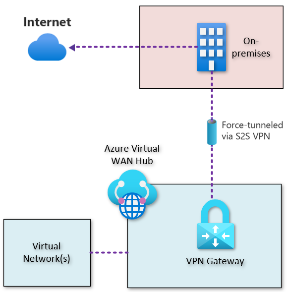

# About forced tunneling for Azure Virtual WAN site-to-site VPN configuration

This article helps you understand how forced tunneling works for site-to-site (S2S) IPsec connections in Azure Virtual WAN. This compliments the existing documentation for VPN Gateway located [here](https://learn.microsoft.com/en-us/azure/vpn-gateway/about-site-to-site-tunneling#configure-using-default-site). 

By default, Internet-bound traffic from your workloads and VMs within a virtual network is sent directly to the Internet. Forced tunneling lets you redirect or "force" all Internet-bound traffic back to your on-premises location via S2S VPN tunnel for inspection and auditing. Whilst this pattern is not recommended for most companies, some enterprise customers may have a requirement to leverage On-Premises based Internet filering solutions for a temporary or protracted period of time. 

The following example shows all Internet traffic being forced through the S2S VPN Gateway, inside of Azure Virtual WAN, back to the on-premises location for inspection and auditing, before egress to the public Internet.

# Configuration methods for forced tunneling

There are a several different ways that you can configure forced tunneling.

## Configure using BGP

You can configure forced tunneling for VPN Gateway via BGP. You need to advertise a default rout of 0.0.0.0/0 via BGP from your on-premises location to Azure so that all your Azure traffic is sent via the VPN Gateway S2S tunnel.

## Configure using Default Site

If you are not using BGP, you can configure forced tunneling by setting _Private Address space_ of your VPN site within Virtual WAN to 0.0.0.0/0. The on-premises VPN device must be configured using 0.0.0.0/0 as traffic selectors.

## Verify

Once either of the above methods are complete, and your IPsec connections is in a _connected_ state, you can observe _effective routes_ for the Default Routing table and you should see 0.0.0.0/0 with a next hop of VPN_S2S_Gateway.
